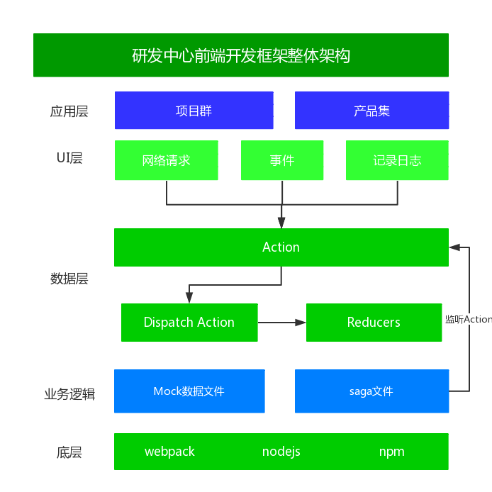
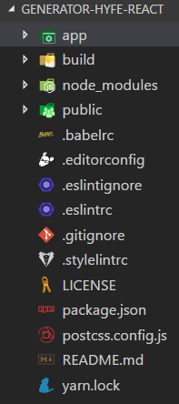
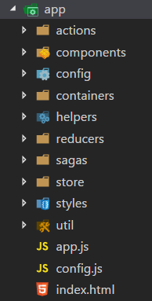
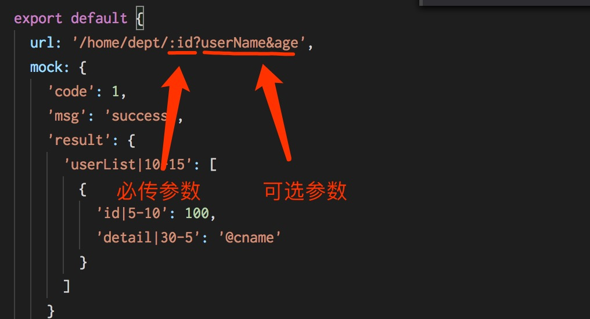

## 研发中心前端技术方案

### 目录

\* [1. 项目简介](#1、项目简介)

\* [2. 项目特色](#2、项目特色)

\* [3. 技术选型](#3、技术选型)

\* [4. 目录结构](#4、目录结构)

\* [5. 开发环境](#5、开发环境)

\* [6. 生成框架](#6、生成框架)

\* [7. 部署](#7、部署)

\* [8. 浏览器兼容](#8、浏览器兼容)

\* [9. 开发指南](#9、开发指南)

\* [10. 扩展功能点](#10、扩展功能点)

\* [11. 更新记录](#10、更新记录)

\* [12. 技术支持](#11、技术支持)

### 1、项目概览

#### 1.1 项目简介

从零开始创建一个新的项目是非常耗时的。作为开发人员，我们应该花费更多的时间来进行业务逻辑的开发，而不是配置项目环境，如配置webpack、eslint等，并且还要尽量避免由于某个包的版本不对导致的问题。generator-hyfe可以帮助开发人员轻松启动并运行，而无需担心构建配置问题，将开发人员从繁琐的项目配置和构建中解放出来，使其有更多的时间专注于业务的开发。

#### 1.2 项目架构

#### 

### 2、项目特色

- 支持多开发环境：开发、测试和线上；
- 统一的编码规范；
- 统一的目录结构；
- 统一的处理流程：异步请求、事件处理；
- 支持Mock数据，及Mock数据与真实接口混用；
- 前沿的技术栈。

### 3、技术选型

- es6/7/next：使用JavaScript语言的最新特性；
- react：构建用户界面；
- redux：数据流管理；
- webpack：资源加载打包；
- react-router：路由管理；
- redux-saga：处理异步请求；
- sass：CSS预处理器；
- react-intl：国际化；
- react-faux-dom：让D3操作虚拟DOM；
- react-loadable：按需加载组件；
- loadsh：工具集；
- axios：发送网络请求；
- mockjs：模拟数据；
- d3.js：绘制个性化图表或关系图；
- echarts/zrender：基础图表或特殊图表；
- eslint：检查前端编码规范。

### 4、目录结构

	

### 5、开发环境

\* []()

\* []()

\* []()

### 6、生成框架

#### 6.1 通过Gitlab获取

说明：暂时通过重庆前端Gitlab获取，后续会迁移到南京统一开发环境上面。

```
$ git clone http://192.168.1.11/hyfe/generator-hyfe-react.git

$ cd < project name >

$ yarn install

$ yarn run dll

$ yarn run start

Server is now running at http://localhost:3000.
```

说明：

- `yarn run dll`指令只需要支持一次，用于将所有公用的包打包成一个动态链接库，可有效地减少打包及每次热替换编译的时间。

#### 6.2 通过脚手架生成

说明：2018年3月15日之前建议使用[6.1](#6.1) 方式获取，脚手架目前正在优化中。

```
$ yarn add generator-hyfe

$ yo generator-hyfe

$ choose generator-hyfe-react

$ cd < project name >

$ yarn install

$ yarn run dll

$ yarn run start

Server is now running at http://localhost:3000.
```

### 7、部署

#### 7.1 修改静态资源部署路径

`build/config/project.config.js`

```
// Server Configuration
// 部署服务器地址、端口和资源部署路径
// 部署服务器地址、端口都是可以不配置的
// 资源部署路径需要和后端确认后配置
server_host : '',
// 如果不配置server_host，server_port仅用于指定本地服务的端口
server_port : process.env.PORT || 8080,
// 资源部署路径
resource_deploy_path: '/protal/static',
```

#### 7.2 修改访问接口地址

详见[9.1.3](#9.1.3) 。

#### 7.3 打包

运行`[npm | yarn] run deploy:prod`或`[npm | yarn] run deploy:dev`创建一个 `dist`目录，其中包含应用程序编译后的版本 。访问根目录下的`index.html`，应用程序将被加载。

- `[npm | yarn] run deploy:dev`：打包后的文件不会压缩，便于在线调试；
- `[npm | yarn] run deploy:prod`： 打包后的文件已压缩，用于部署。

### 8、浏览器兼容

\* Chrome

\* Mozilla

\* Safari

### 9、开发指南

开发过程中目录结构必须统一，下面从一级目录和app目录下的二级目录层面分别进行介绍。

一级目录：

| 目录名    | 作用      | 备注           |
| ------ | ------- | ------------ |
| app    | 源码      |              |
| build  | 打包编译的脚本 |              |
| dist   | 打包后的文件  | 使用该文件夹中的内容部署 |
| public | 公用静态资源  | 一般不用         |

app目录下的二级目录：

| 目录/文件       | 作用                          | 备注                                |
| ----------- | --------------------------- | --------------------------------- |
| actions     | 动作触发的actions                | 每个action都是纯函数，不涉及网络请求等副作用         |
| components  | 展示组件                        | 仅负责展示，数据通过containers中组件传递         |
| config      | 配置项                         | 全局配置项和合并的子模块配置项                   |
| containers  | 容器组件                        | 具有业务逻辑的组件                         |
| reducers    | 接收action和新state，返回处理后的state |                                   |
| sagas       | 业务逻辑、网络请求处理和Mock数据          | 区别于redux-thunk，统一使用saga管理异步请求     |
| store       | 统一的数据源                      | 加入了redux-saga、redux-logger等中间件的处理 |
| style       | 公用样式文件                      | 各子模块样式文件遵循就近原则，和各自组件放到一起          |
| util        | 工具类                         | 国际化、提前加载、页面缩放、创建action、封装请求等      |
| util.loader | 页面渲染前提前加载内容                 | 提前加载的内容分为子模块配置项和Mock数据            |
| util.zoom   | 页面缩放功能                      | 按照比例对页面进行缩放                       |
| app.js      | 应用程序主入口文件                   |                                   |
| index.html  | 应用程序HTML文件                  |                                   |

#### 9.1 开发环境配置

修改`app/config/base.config.js`。

##### 9.1.1 开启mock数据支持

```
// 是否使用mock模式，在mock模式下向服务器的请求被mockjs拦截
mock: true, // search.indexOf('mock') !== -1,
// 是否使用proxy模式，在proxy模式下会使用proxy的url来替换原来的url
proxy: false
```

##### 9.1.2 切换到联调模式

```
// 是否使用mock模式，在mock模式下向服务器的请求被mockjs拦截
mock: false, // search.indexOf('mock') !== -1,
// 是否使用proxy模式，在proxy模式下会使用proxy的url来替换原来的url
proxy: true,
```

##### 9.1.3 切换到部署模式

```
// 是否使用mock模式，在mock模式下向服务器的请求被mockjs拦截
mock: false, // search.indexOf('mock') !== -1,
// 是否使用proxy模式，在proxy模式下会使用proxy的url来替换原来的url
proxy: false
```

#### 9.2 初始化操作

在项目入口文件`app.js`中，通过以下操作：

```
// 渲染前处理
import preLoader from '@/helpers/preloader'
import mockAPI from '@/sagas/mockIndex'

// ========================================================
// Mock & Config Setup
// 渲染前设置配置项和mock API，config为子模块配置项
// ========================================================
preLoader.load({
  config: {},
  apis: mockAPI
})
```

实现在渲染页面之前，加载各个子模块的配置项和开启Mock数据。

#### 9.3 异步请求

##### 9.3.1 普通`http`请求

所有的异步请求都经过了一层封装，使用方式如下：

```
import { fetch } from '@/util/request'
/**
 * @description 使用github API获取用户信息
 * @param {string} username 用户名
 * @param {number} page 当前页数
 * @return {promise} 返回结果的Promise
 */
const apifetchUser = (username, page) => {
  return fetch('fetchUserList', {
    username,
    page
  })
}
```

说明：

- `fetchUserList`对应mock文件export的名称，文件路径`app/sagas/mockIndex.js`；

  ```
  import fetchUserList from './user/userList'

  export default {
    fetchUserList
  }
  ```

##### 9.3.2 `websocket`

`websocket`和普通的`http`请求在`mock`数据配置上有所差别，使用`websocket`时需要在`mock`数据文件中你那个添加`isWebsocket: true`配置项，同时需要使用`fetchSocket`方法，`fetchSocket`方法通过`import { fetchSocket } from '@/util/request'`引入。`fetchSocket`方法是个高阶函数：第一层参数传入`mock`名称、参数及回调函数；第二层参数传入生成成功后的action的方法。如下：

```javascript
import { call, put, take } from 'redux-saga/effects'
import { fetchSocket } from '@/util/request'
import { requestFailed } from '@/actions/commonAction'
import {
  PERSONNEL_ALARM_INFO_REQUEST,
  personnelAlarmInfoSuccess
} from '@/actions/personnelAlarmInfoAction'

const apifetchPersonnelAlarmInfo = (personnelAlarmInfoSuccess) => 		   fetchSocket('fetchPersonnelAlarmInfo')(personnelAlarmInfoSuccess)

export function* fetchPersonnelAlarmInfo() {
  yield take(PERSONNEL_ALARM_INFO_REQUEST)
  yield call(apifetchPersonnelAlarmInfo, personnelAlarmInfoSuccess)
}
```

##### 9.3.3 `reduxSagaInjector`

鉴于之前的http和websocket请求都要手动创建`action`，`saga`，`reducer`，重复性工作太多。全新的`reduxSagaInjector`
是一个整合了自动生成`action`、动态生成`saga`、动态注入`reducer`、触发`action`等多功能为一体的高阶函数。通过
`import reduxSagaInjector from '@/util/reduxSagaInjector'`方式引入。api如下：

```javascript
  reduxSagaInjector(dispatch, actionKey)(apiName, params, reducerName, isSocket)
```

参数说明:

- dispatch: dispatch对象
- actionKey: 需要提供生成action的type值的关键字，底层会拼接上`REQUEST`和`SUCCESS`等分别作为发送请求和请求成功
  要触发的action的type值。
- apiName: 要请求的后端api的名称，这必须和mockIndex中的名称一致
- params: 请求需要的参数
- reducerName: 最终存放到store中时结果集的名称，在`mapStateToProps`中可以通过此名称取到你需要的数据集。**如果这里传的是一个函数，那么它将接收一个result参数作为请求成功后接口返回的数据集。注意：这种情况的异步数据将不再进入redux状态管理中，而与一般的异步回调没什么差别**
- isSocket: 如果你要请求的是websocket，那么这个参数必须要显示设置为`true`,默认情况下http请求不需要设置

假设你想要从后端请求websocket数据，你可以像下面这样操作：

```javascript
  reduxSagaInjector(dispatch, 'USER_LIST')('fetchUserList', {list: 3}, 'dataSet', true)
```

在`mapStateToProps`里可以像这样获取到数据：

```javascript
  const mapStateToProps = ({ dataSet }) => {
    if(!dataSet) return {} // 由于reducer是动态注入，其他action被触发的时候，dataSet是undefined
    return {
      userList: dataSet.userList,
      ws: dataSet.ws
    }
  }
```

ws对象只有websocket请求才会返回，http请求是undefined。

说明：

- 传统手写action、saga、reducer的方式依旧生效。
- http请求的完整例子可以参考`@/containers/users/userList.js`
- websocket请求的完整例子可以参考`@/containers/list/list.js`
- reducerName作为回调函数的完整例子可以参考`@/containers/home/appHomeContainer.js`中的logout功能

<span style="color:red;">注意：使用此方法依赖于`@/reducers/index.js`中的`asyncReducers`，所以`makeRootReducer`方法的参数`asyncReducers `一定不能删！！！</span>

#### 9.4 Mock数据

通过使用Mock数据，便于前端离线开发或联调。

##### 9.4.1 必须参数使用`/`拼接到URL中

`app/sagas/user/userList.js`

```
/*
 * @Author: baizn 
 * @Email: baizhanning@hiynn.com 
 * @Description: 获取用户列表mock数据
 * @Date: 2018-02-12 11:11:18 
 * @Last Modified by: baizn
 * @Last Modified time: 2018-02-12 11:41:35
  */
  
export default {
  url: '/user/:list',
  // 默认值为false，可省略
  enableMock: false,
  mock: {
    'code': 1,
    'msg': 'success',
    'result|10-15': [
      {
        'id|5-10': 100,
        'detail|3-5': '@cname'
      }
    ]
  }
}
```

##### 9.4.2 可选参数通过`?`拼接到URL中

```
export default {
  url: '/home/dept/:id?userName&age',
  mock: {
    'code': 1,
    'msg': 'success',
    'result':  {
      "countryList|10": [
        {
            "id": "@id",
            "name|+1": ['外交部',  '发展改革委', '教育部', 
            '科技部', '工信部', '国家民委', '公安部', '民政部', '司法部', '财政部']
        }
      ]
    }
  }
}
```

##### 9.4.3 `Mock URL`示例



说明：

- 可选参数可以省去“=”后面的内容，直接将变量名以“&”相连即可。传参的时候会根据参数动态判定，如果存在就以&拼接，如果不存在变量名也不会出现在URL地址里。示例可参考：`@/containers/users/userList.js`中的`reload`方法，点击界面上“带可选参数请求”的按钮就会调用这个方法

##### 9.4.4 `Mock`对象配置项说明

- `url`：请求后端接口的URL，不包括IP、端口、项目名等公用部分；
- `enableMock`：是否局部支持`mock` 数据，默认值为`false`，即默认不支持局部`Mock`，设置为`true`后，支持局部`Mock`数据；
- `isWebsocket`：是否是`websocket`请求，默认值为`false`；
- `config`：`ajax`请求的配置项：
  - `method`：请求方式，默认为`get`， 支持`post`、`put`、`delete`等方法；
  - `contentType`：请求中的媒体类型信息，主要设置发送给服务器的格式：
    - 默认值：`application/x-www-form-urlencoded; charset=UTF-8`；
    - `application/json`：发送给服务器端之前，需要使用`JSON.stringify`序列化；
    - `multipart/form-data`：用于文件上传。

#### 9.5 同时支持Mock数据和后端接口

在实际开发过程中，会遇到以下情况：

- 同一个产品/项目中，一部分接口已经开发完成，而另外一部分接口正在开发；
- 同一个产品/项目中，一部分需要调用后端真实接口，另外一部分需要使用假数据，并且后端不提供接口。

要处理以上情况，前端开发框架就需要支持部分接口调用真实后端接口，部分接口被`mock.js`拦截，使用生成的模拟数据，实现以上需求的配置如下：

- 修改`app/config/base.config.js`中的`mock`字段为`false`，表示全局调用后端接口，不使用本地模拟数据；
- 修改各个`saga`文件中的`mock`数据对象，添加`enableMock: true`配置项，该配置项会覆盖全局的`mock`配置，表示该接口使用本地`Mock`数据：
  - `enableMock`字段默认值为`false`，可省略；
  - 设置该字段为`true`后，说明该接口需要使用本地`Mock`数据，同时必须设置`app/config/base.config.js`中的`mock`字段为`false` 。

#### 9.6 业务逻辑处理

所有业务逻辑的处理都统一在`saga`中处理，如下所示：

`app/sagas/user/userSaga.js`

```
import { call, put, take } from 'redux-saga/effects'
import { fetch } from '@/util/request'

import { 
  LOAD_USER_REQUEST, 
  loadUserSuccess, 
  loadUserFailed } from '@/actions/userAction'

/**
 * @description 使用github API获取用户信息
 * @param {string} username 用户名
 * @param {number} page 当前页数
 * @return {promise} 返回结果的Promise
 */
const apifetchUser = (username, page) => {
  return fetch('fetchUserList', {
    list: 'xxx'
  })
}

/**
 * @description 获取用户信息
 * @param {object} action action类型
 */
export function* fetchUser(action) {
  try {
    const { username, page } = yield take(LOAD_USER_REQUEST, fetchUser)
    const user = yield call(apifetchUser, username, page)
    yield put(loadUserSuccess(user.data))
  } catch (error) {
    yield put(loadUserFailed(error.message))
  }
}
```

#### 9.7 React中使用D3图表组件

D3操作的是真实的DOM元素，而在React中，我们都倾向于操作虚拟DOM，可以通过`react-faux-dom`很好地将两者结合起来，让D3操作虚拟DOM，并且使用D3的方式不做任何改变，只需要改动以下一点即可：原有D3组件的`render`方法添加第二个参数，参数类型为函数。

使用原有D3组件的方式需要结合到React生命周期方法中，框架封装了渲染D3组件的高阶组件：`app/util/d3ChartFactory.jsx` 。

使用方式参考：`app/containers/product/productSubContainers.js` ：

```
// 引入D3组件高阶组件
import D3ChartFactory from '@/util/d3ChartFactory'
// 引入需要渲染的D3图表组件
import { Pie } from '@/charts'

// 将需要渲染的D3组件作为参数传递给D3ChartFactory高阶组件
const D3ChartComponent = D3ChartFactory(Pie)

render() {
    const { result } = this.props
    if(!result) {
      return null
    }

    return (
      <div className="product-sub-layout">
        <Button type='primary' onClick={this.changeData}>更新数据</Button>
        <D3ChartComponent data={this.props.result} />
      </div>
    )
  }
```

#### 9.8 多服务端配置

有些项目中，后端提供的服务可能不止在一台服务器上，那么，在配置的`base.config.js`里，可以将`host`配置成数组，然后，在`mock`里增加一个`hostIndex`属性，表示你当前的接口地址需要拼接host地址列表里的哪个地址。`host`依然保留直接配置成地址字符串，此时`mock`里不需要有任何额外的配置。如果`host`是个数组，但是`mock`里又没有配置`hostIndex`，那么`url`拼接的时候会默认取`host`中的第一个地址：
```javascript
/*base.config.js*/
host: ['http://192.168.1.11:8080', 'http://192.168.5.55:8080']

/*mock*/
export default {
  url: '/pie',
  hostIndex: 1,
  mock: {
    'code': 1,
    'msg': 'success',
    'result': []
  }
}
```
上面例子拼接后的url完整地址会是：http://192.168.5.55:8080/pie

### 10、扩展功能点

- 【已完成】React与D3结合，实现让D3操作虚拟DOM，计划于20180320之前完成；
- React与echarts、zrender结合，所有绘制在虚拟DOM上面进行。

### 11、更新记录
- 20180911-优化可选参数拼接方式及`reduxSagaInjector `支持传入回调；
- 20180601-新增`reduxSagaInjector`，封装数据请求流程；
- 20180531-封装渲染D3组件的高阶组件，简化使用D3组件的样板代码；
- 20180525-优化项目配置项，部署服务器地址和端口可选；
- 20180422-实现saga结合WebSocket推送以及mock下模拟WebSocket推送的功能；
- 20180408-支持调用真实接口和Mock数据；
- 20180328-优化webpack打包配置；
- 20180315-生成模式下压缩CSS，使用react生成版本；
- 20180315-修复生成模式下打包出错的BUG；
- 20180312-React中使用D3，D3操作虚拟DOM；
- 20180309-添加组件按需加载的功能；
- 20180307-搭建开发框架，统一框架规范；

### 12、技术支持

- 海云数据研发中心平台前端组

